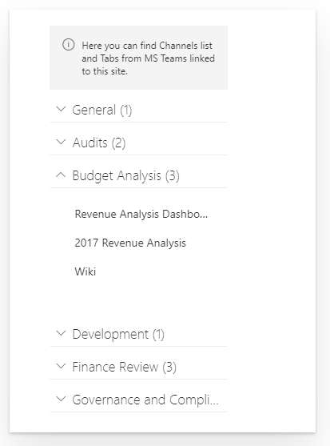
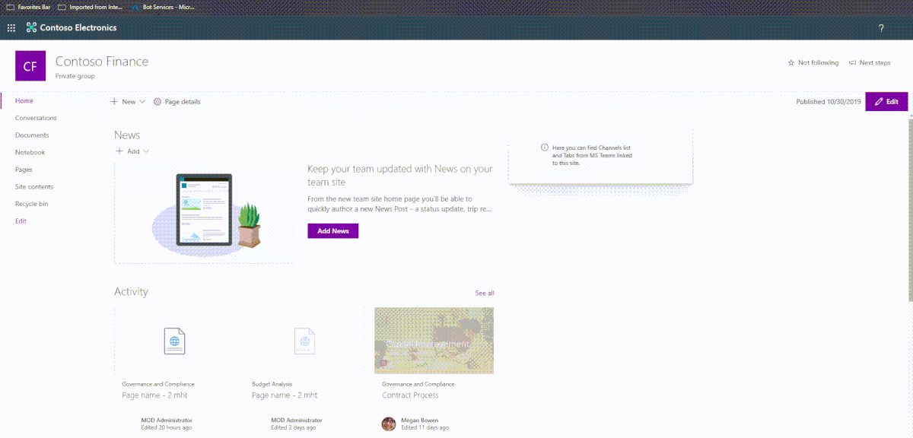

# react-teams-tabs-pnpjs - MS Teams Channels and Tabs from Modern Team site.

## Summary

A SPFx WebPart using [@pnp/graph/teams](https://pnp.github.io/pnpjs/graph/docs/teams/). It shows Channels and Tabs from a Modern Team Site connected to Microsoft Teams. 
The WebPart will show the list of all channels of the Modern Team Sites linked teams. Nested inside Channels list, you will find Tabs link.

## react-teams-tabs-pnpjs preview

## react-teams-tabs-pnpjs in action

## Used SharePoint Framework Version

## Applies to

* [SharePoint Framework](https:/dev.office.com/sharepoint)
* [Office 365 tenant](https://dev.office.com/sharepoint/docs/spfx/set-up-your-development-environment)

## Solution

Solution|Author(s)
--------|---------
react-teams-tabs-pnpjs |  [Federico Porceddu](https://www.federicoporceddu.com)

## Version history

Version|Date|Comments
-------|----|--------
1.0|October 30, 2019|Initial release

## Disclaimer

**THIS CODE IS PROVIDED *AS IS* WITHOUT WARRANTY OF ANY KIND, EITHER EXPRESS OR IMPLIED, INCLUDING ANY IMPLIED WARRANTIES OF FITNESS FOR A PARTICULAR PURPOSE, MERCHANTABILITY, OR NON-INFRINGEMENT.**

---

## Minimal Path to Awesome

* Clone this repository
* in the command line run:
  * restore dependencies: `npm install`
  * build solution `gulp build --ship`
  * bundle solution: `gulp bundle --ship`
  * package solution: `gulp package-solution --ship`
  * locate solution at `.\sharepoint\solution\react-teams-tabs-pnpjs.sppkg` 
  * upload it to your tenant app catalog
  * [approve permission requests](https://docs.microsoft.com/en-us/sharepoint/dev/spfx/use-aadhttpclient#manage-permission-requests) into SharePoint Online Admin API Permission page
  * add `react-teams-tabs-pnpjs` app to your site
  * add `react-teams-tabs-pnpjs` webpart to your page to see it in action

## Features

This Web Part illustrates the following concepts on top of the SharePoint Framework:

* How to use Microsoft Graph with PnPJS
* How to use [@pnp/graph/teams](https://pnp.github.io/pnpjs/graph/docs/teams/)
* How to configure SharePoint Online Tenant and SPFx solution to allow Microsoft Graph calls.
* Microsoft Graph API for Microsoft Teams
* [Fabric UI Nav component](https://developer.microsoft.com/en-us/fabric#/controls/web/nav)

